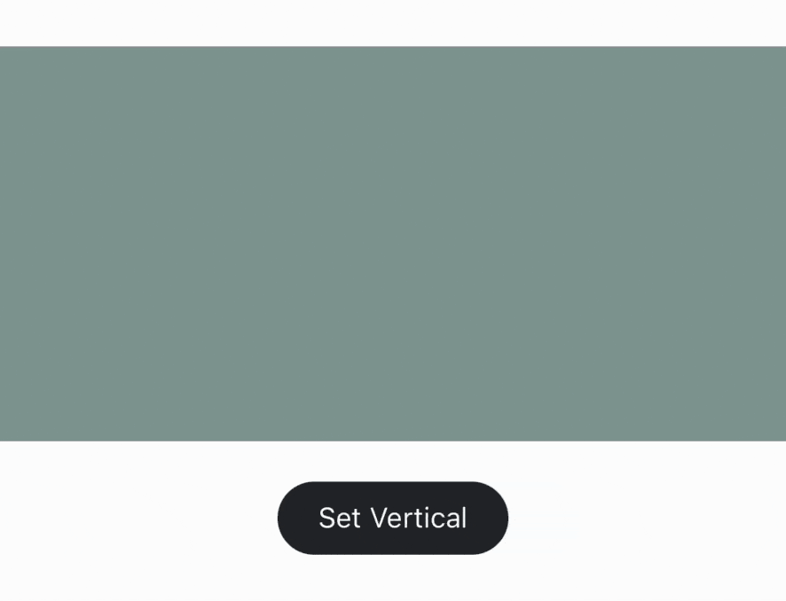
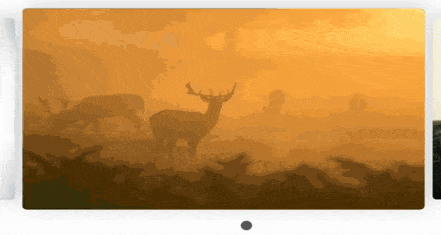
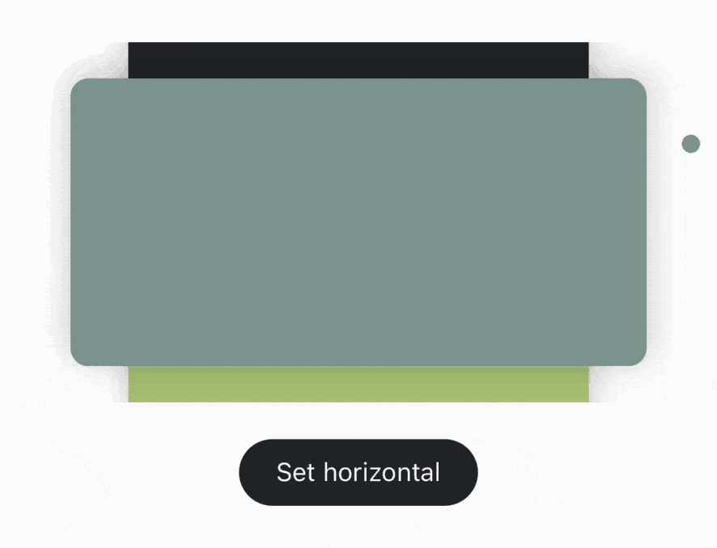
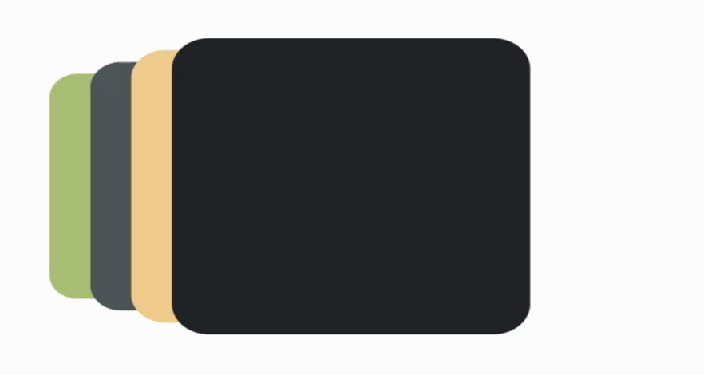
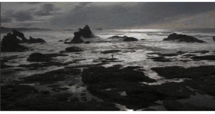
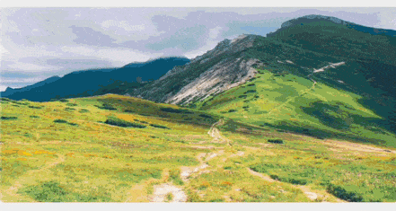

English | [简体中文](./README.zh-CN.md)

# react-native-reanimated-carousel


[](https://www.npmjs.com/package/react-native-reanimated-carousel)
[](https://www.npmjs.com/package/react-native-reanimated-carousel)
[](https://www.npmjs.com/package/react-native-reanimated-carousel)
[](https://github.com/dohooo/react-native-reanimated-carousel/issues)
[](https://github.com/dohooo/react-native-reanimated-carousel/issues?q=is%3Aissue+is%3Aclosed)
[](https://discord.gg/KsXRuDs43y)

## ReactNative community's best use of the carousel component! 🎉🎉🎉

-   **It completely solves this** [[problem]](https://github.com/meliorence/react-native-snap-carousel/issues/632) **for `react-native-snap-carousel`!**
-   **Simple**, **Infinitely scrolling very smooth**, **Fully implemented using Reanimated 2!**

> V2 has been released! Join it! [[v1 docs]](https://github.com/dohooo/react-native-reanimated-carousel/tree/v1.x.x)

> Support to Web [[demo]](https://dohooo.github.io/react-native-reanimated-carousel/)

> Click on the image to see the code snippets. [[Try it]](https://snack.expo.dev/@zhaodonghao586/simple-carousel) 🍺

|                             |                                |                             |
| :------------------------------------------------------------------: | :-------------------------------------------------------------------: | :--------------------------------------------------------------------: |
|  <a href="./exampleExpo/src/normal/index.tsx">normal-horizontal</a>  |   <a href="./exampleExpo/src/normal/index.tsx">normal-vertical</a>    | <a href="./exampleExpo/src/parallax/index.tsx">parallax-horizontal</a> |
|                             |                          |                          |
| <a href="./exampleExpo/src/parallax/index.tsx">parallax-vertical</a> | <a href="./exampleExpo/src/stack/index.tsx">stack-horizontal-left</a> | <a href="./exampleExpo/src/stack/index.tsx">stack-horizontal-right</a> |
|                           |                           |                          |
| <a href="./exampleExpo/src/stack/index.tsx">stack-vertical-left</a>  | <a href="./exampleExpo/src/stack/index.tsx">stack-vertical-right</a>  | <a href="./exampleExpo/src/stack/index.tsx">stack-horizontal-right</a> |
|                                    |
|   <a href="./exampleExpo/src/left-align/index.tsx">left-align</a>    |


> Now you can make cool animations with us! Very easy! [[Details]](./docs/custom-animation.md)

|                                                    |                                            |                                      |
| :-----------------------------------------------------------------------------------------: | :---------------------------------------------------------------------------------------: | :---------------------------------------------------------------------------: |
|        <a href="./exampleExpo/src/advanced-parallax/index.tsx">advanced-parallax</a>        | <a href="./exampleExpo/src/pause-advanced-parallax/index.tsx">pause-advanced-parallax</a> | <a href="./exampleExpo/src/scale-fade-in-out/index.tsx">scale-fade-in-out</a> |
|                                             |                                                      |                                           |
| <a href="./exampleExpo/src/rotate-scale-fade-in-out/index.tsx">rotate-scale-fade-in-out</a> |           <a href="./exampleExpo/src/rotate-in-out/index.tsx">rotate-in-out</a>           |      <a href="./exampleExpo/src/anim-tab-bar/index.tsx">anim-tab-bar</a>      |
|                                                              |                                                           |                                               |
|                  <a href="./exampleExpo/src/marquee/index.tsx">marquee</a>                  |                <a href="./exampleExpo/src/multiple/index.tsx">multiple</a>                |          <a href="./exampleExpo/src/circular/index.tsx">circular</a>          |
|                                                                 |                                                               |                                            |
|                     <a href="./exampleExpo/src/fold/index.tsx">fold</a>                     |                    <a href="./exampleExpo/src/tear/index.tsx">tear</a>                    |       <a href="./exampleExpo/src/press-swipe/index.tsx">press-swipe</a>       |
|                                                              |                                                      |                                                  |
|                  <a href="./exampleExpo/src/cube-3d/index.tsx">cube-3d</a>                  |           <a href="./exampleExpo/src/blur-parallax/index.tsx">blur-parallax</a>           |               <a href="./exampleExpo/src/curve/index.tsx">curve</a>           |
|                                                      |                                                        |                                                   |
|          <a href="./exampleExpo/src/parallax-layers/index.tsx">parallax-layers</a>          |             <a href="./exampleExpo/src/stack-cards/index.tsx">stack-cards</a>             |              <a href="./exampleExpo/src/flow/index.tsx">flow</a>              |

## Table of contents

1. [Installation](#Installation)
1. [Usage](#Usage)
1. [Props](./docs/props.md)
1. [Tips](#Tips)
1. [Reason](#Reason)
1. [Example](#Example)

## Installation

Open a Terminal in the project root and run:

```sh
yarn add react-native-reanimated-carousel
```

Or if you use npm:

```sh
npm install react-native-reanimated-carousel
```

Now we need to install [`react-native-gesture-handler`](https://github.com/kmagiera/react-native-gesture-handler) and [`react-native-reanimated(>=2.0.0)`](https://github.com/kmagiera/react-native-reanimated).

|                                        | react-native-reanimated | react-native-gesture-handler |
| -------------------------------------- | ----------------------- | ---------------------------- |
| react-native-reanimated-carousel < v3  | <2.7.0                  | \*                           |
| react-native-reanimated-carousel >= v3 | >=2.7.0                 | \*                           |

## Usage

```tsx
import * as React from 'react';
import { Dimensions, Text, View } from 'react-native';
import Carousel from 'react-native-reanimated-carousel';

function Index() {
    const width = Dimensions.get('window').width;
    return (
        <View style={{ flex: 1 }}>
            <Carousel
                loop
                width={width}
                height={width / 2}
                autoPlay={true}
                data={[...new Array(6).keys()]}
                scrollAnimationDuration={1000}
                onSnapToItem={(index) => console.log('current index:', index)}
                renderItem={({ index }) => (
                    <View
                        style={{
                            flex: 1,
                            borderWidth: 1,
                            justifyContent: 'center',
                        }}
                    >
                        <Text style={{ textAlign: 'center', fontSize: 30 }}>
                            {index}
                        </Text>
                    </View>
                )}
            />
        </View>
    );
}

export default Index;

```

## Tips

-   Optimizing

    -   When rendering a large number of elements, you can use the 'windowSize' property to control how many items of the current element are rendered. The default is full rendering. After testing without this property, frames will drop when rendering 200 empty views. After setting this property, rendering 1000 empty views is still smooth. (The specific number depends on the phone model tested)

-   Used in `ScrollView/FlastList`

    -   **[#143](https://github.com/dohooo/react-native-reanimated-carousel/issues/143) - Carousel suppresses ScrollView/FlastList scroll gesture handler:** When using a carousel with a layout oriented to only one direction (vertical/horizontal) and inside a ScrollView/FlatList, it is important for the user experience that the unused axis does not impede the scroll of the list. So that, for example, the x-axis is free we can change the [activeOffsetX](https://docs.swmansion.com/react-native-gesture-handler/docs/1.10.3/api/gesture-handlers/pan-gh/#activeoffsetx) of the gesture handler:

        ```tsx
        <Carousel
          {...}
          panGestureHandlerProps={{
            activeOffsetX: [-10, 10],
          }}
        />
        ```

-   RTL
    -   Support to RTL mode with no more configuration needed. But in RTL mode, need to manually set the autoPlayReverse props for autoplay to control scrolling direction.
-   EXPO
    -   If use EXPO managed workflow please ensure that the version is greater than 41.Because the old version not support `Reanimated(v2)`.
-   Working principle
    -   [About RNRC](./docs/about.md)

## Reason

<details>
<summary>The common RN infinite scroll component. It get stuck on a fast slide. Wait for the next element to appear. This component will not have similar problems.Because using a completely different approach so the best performance is achieved.That's why this library was created.</summary>
<p align="center">
  Use react-native-snap-carousel for quick swiping,you can see caton clearly when you reach the junction.(gif 4.6mb)
</p>
<p align="center">
  
</p>

<p align="center">
  Compared with react-native-reanimated-carousel,The actual test was ten slides per second, but it didn't show up very well in gif.
</p>
<p align="center">
  
</p>
</details>

## Example

> `:pretty` use pretty images

```shell
yarn ios
yarn ios:pretty

yarn android
yarn android:pretty

yarn web
yarn web:pretty
```

## Sponsors

<p align="center">
  
</p>

## License

MIT
