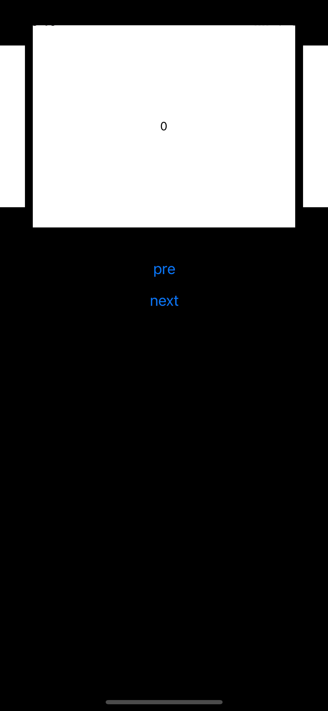

# react-native-reanimated-carousel

<p align="center">
  
</p>

<br/>

<h3 align="center">Simple carousel component!</h3>
<h3 align="center">Infinitely scrolling very smooth!</h3>
<h3 align="center">Fully implemented using Reanimated 2!</h3>

> The common RN infinite scroll component. It's common to get stuck on a fast slide. Wait for the next element to appear. This component will not have similar problems. That's why this library was created.

## Installation

Open a Terminal in the project root and run:

```sh
yarn add react-native-reanimated-carousel
```

Or if you use npm:

```sh
npm install react-native-reanimated-carousel
```

Now we need to install [`react-native-gesture-handler`](https://github.com/kmagiera/react-native-gesture-handler) and [`react-native-reanimated(>=2.0.0)`](https://github.com/kmagiera/react-native-reanimated).
Don't use Expo to install reanimated it not supported `Reanimated(v2)`

## Usage

```typescript
import Carousel from "react-native-reanimated-carousel";

// ...

<Carousel<{ color: string }>
  width={width}
  data={[{ color: "red" }, { color: "purple" }, { color: "yellow" }]}
  renderItem={({ color }) => {
    return (
      <View
        style={{
          backgroundColor: color,
          justifyContent: "center",
          flex: 1,
        }}
      />
    );
  }}
/>;
```

## Props

| name                    | required | default         | types                                       | description                                                                    |
| ----------------------- | -------- | --------------- | ------------------------------------------- | ------------------------------------------------------------------------------ |
| data                    | true     |                 | T[]                                         | Carousel items data set                                                        |
| width                   | true     |                 | number                                      | Specified carousel container width                                             |
| renderItem              | true     |                 | (data: T, index: number) => React.ReactNode | Render carousel item                                                           |
| autoPlay                | false    | false           | boolean                                     | Auto play                                                                      |
| autoPlayReverse         | false    | false           | boolean                                     | Auto play reverse playback                                                     |
| autoPlayInterval        | false    | 1000            | autoPlayInterval                            | Auto play playback interval                                                    |
| mode                    | false    | defalut         | 'default'\|'parallax'                       | Carousel Animated transitions                                                  |
| loop                    | false    | true            | boolean                                     | Carousel loop playback                                                         |
| parallaxScrollingOffset | false    | 100             | number                                      | When use 'default' Layout props,this prop can be control prev/next item offset |
| parallaxScrollingScale  | false    | 0.8             | number                                      | When use 'default' Layout props,this prop can be control prev/next item scale  |
| style                   | false    | {}              | ViewStyle                                   | Carousel container style                                                       |
| height                  | false    | '100%'          | undefined \| string \| number               | Specified carousel container height                                            |
| timingConfig            | false    | {duration: 250} | Animated.WithTimingConfig                   | Timing config of translation animated                                          |

## Ref

| name            | types      | description            |
| --------------- | ---------- | ---------------------- |
| prev            | ()=>void   | Play the last one      |
| loop            | ()=>void   | Play the next one      |
| goToIndex | (index: number, animated?: boolean) => void | Go to index |
| getCurrentIndex | ()=>number | Get current item index |

## Contributing

See the [contributing guide](CONTRIBUTING.md) to learn how to contribute to the repository and the development workflow.

## License

MIT
