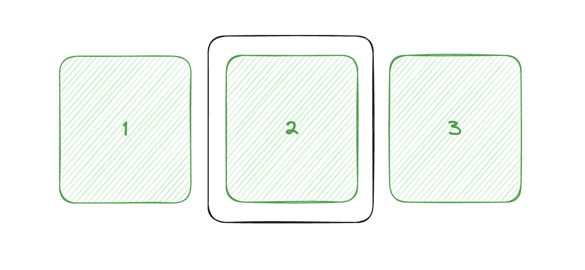
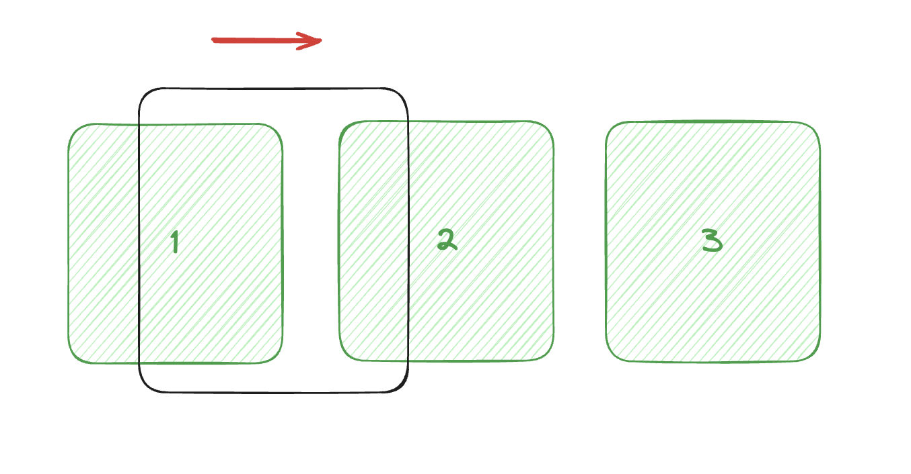
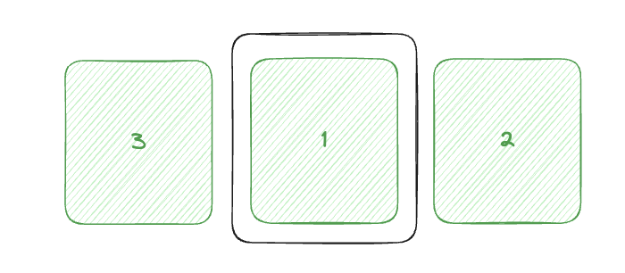

## About RNRC
About the internal implementation of RNRC(react-native-reanimated-carousel).

### Working principle
This is what we expect to see in the execution of RNRC.

1. First we have three images by default and have slid to the second image in the middle

2. When we drag the image to the right


3. When the first image is partially in the viewport, we move the last image to the front

4. So we've done a circular scroll to one side and the other way around. It works by sliding and appending, and relies on reanimated, so the whole processing logic is still done in the UI thread, and moving images doesn't cause animation to freeze.


This is how it works in code.

> I don't think I have explained this logic clearly, but this is a version that has been revised many times, it is a complicated process, if any partners have their own understanding, welcome to submit PR, we will make this explanation more clear.  
> In my opinion, this part is undoubtedly very important for the initial stage of project development, but it is no longer so "important" at present, because the underlying content of this part will no longer change significantly. If you are interested in it, you can understand it, otherwise I don't think it is necessary to understand it.  

1. First we need a unit `size` to help us calculate the scroll distance. When horizontal, `size` is equal to the `width` prop setting, when vertical, `size` is equal to the `height` prop setting.

2. Then we need a value `handlerOffset`, which is the current scroll distance, and it's a total value, if we scroll two, `handlerOffset` is equal to `size` * 2, if we scroll ten, `handlerOffset` is equal to `size` * 10.

3. Followed by dealing with how to get at the end of the element at the right time to move to the front, this part of logic in `./src/hooks/useOffsetX.ts`. First we need to know the current window size (the total number of elements rendered on one side). The window size defaults to half the total number of elements, i.e. full render.


From the value of the window size we can calculate the position of the end of the forward or reverse element.


Then we need to find the boundary (see if the image moves to the front). Currently we set this position to the total length of the side plus half the size of the element. This position is affected by the `windowSize` and can be changed using `windowSize` prop. For example, if `windowSize` is not set and the data length is 5, then one side length is size * (5-1)/2 = size * 2, then the boundary is size * 2 + size * 0.5, if `windowSize` is set to 3, then the boundary is size * 2 + size * 0.5. Size * (3-1)/2 = size * 1, size * 1 + size * 0.5


In order to control the position of the elements more intuitively, we place the elements at the origin, and they all overlap at the origin, `translateX:0`. In this case, we need to calculate the base position of each element `startPos` based on the index of the element, for example, the base position of the first image is 0, the base position of the second image is SIZE, the base position of the third image is size * 2, and so on. Then, keeping the position of each element relative to each other, we subtract each element from its base position `startPos` and add the minimum boundary value `number.min_value`, so that we have the logic to change position immediately if we cross the `boundary`. It will be converted automatically by `outputRange`.

The above logic is translated into code as follows:

```tsx
    const inputRange = [
        -TOTAL_WIDTH,
        MIN - HALF_WIDTH - startPos - Number.MIN_VALUE,
        MIN - HALF_WIDTH - startPos,
        0,
        MAX + HALF_WIDTH - startPos,
        MAX + HALF_WIDTH - startPos + Number.MIN_VALUE,
        TOTAL_WIDTH,
    ];
    const outputRange = [
        startPos,
        MAX + HALF_WIDTH - Number.MIN_VALUE,
        MIN - HALF_WIDTH,
        startPos,
        MAX + HALF_WIDTH,
        MIN - HALF_WIDTH + Number.MIN_VALUE,
        startPos,
    ];
    return interpolate(
        handlerOffset.value,
        inputRange,
        outputRange,
        Extrapolate.CLAMP
    );
```

4. Now we have a nice x value that behaves differently for different indexes. For example, when we want the second element to come after the first, we can do something like this
```tsx
const inputRange = [-1, 0 ,1]
const outputRange = [-size, 0 ,size]
return {
    transform: [
        { translateX: interpolate(handlerOffset.value, inputRange, outputRange) },
    ],
}
```
So when the first one is at the origin `translateX:0`, the next one is at the origin `translateX:size`, because the first one receives an X value of 0 and the second one receives an X value of 1. And if we continue to drag to the left, then -1 approaches -1.5, which, according to our logic, exceeds `-1.50000...00001`, the left most image receives an X value of `1.49999... 00001`, which triggers the logic to change position.

### Directory
```
./src
├── Carousel.tsx # RNRC component `entry file`
├── LazyView.tsx # ShouldUpdate prop controls whether to display elements
├── ScrollViewGesture.tsx # Gesture logic `entry file`
├── constants
│   └── index.ts # Constants defined
├── hooks
│   ├── useAutoPlay.ts # Managing Auto Play
│   ├── useCarouselController.tsx # The controller that manages the behavior of the multicast graph (previous, next...)
│   ├── useCheckMounted.ts # Check whether the wheel cast diagram has been mounted
│   ├── useCommonVariables.ts # Pull some common variables from Props
│   ├── useInitProps.ts # Initialize the Props passed in
│   ├── useLayoutConfig.ts # parallax, horizontal-stack... Returns different animationStyles
│   ├── useOffsetX.ts # The core logic of when to move the end slide to the start position
│   ├── useOnProgressChange.ts # Listen for scrolling progress changes
│   ├── usePropsErrorBoundary.ts # Used to catch setup errors for Props
│   └── useVisibleRanges.tsx # Manages the visibility of the carousel elements
├── index.tsx
├── layouts # Some basic layouts are defined
│   ├── BaseLayout.tsx
│   ├── ParallaxLayout.tsx
│   ├── index.tsx # Layout entry file that returns the various animationStyles defined.
│   ├── normal.ts
│   ├── parallax.ts
│   └── stack.ts
├── store
│   └── index.ts # ContextStore for Props and some base variables
├── types.ts # The type definition
└── utils # Some tool methods.
    ├── computedWithAutoFillData.ts # When the default data is insufficient, the data will be automatically completed and can also be turned off with `autoFillData` prop, so this file provides ways to handle two different cases.
    ├── dealWithAnimation.ts # Encapsulates and handles both Spring/Timing animation types
    └── log.ts # The utility method used to type logs in `worklet` functions
```

### Development
1. Run `yarn dev` in the root directory.
2. Run `yarn ios/ yarn android/yarn web` on exampleExpo.
3. Modify the files under './src/*'to see the changes.

### Tips
How to add a new animation effect?

We recommend you to use ['customAnimation'](./custom-animation.zh-cn.md) prop to do this, as this is a more flexible and easy way to do it.

1. In `./exampleExpo/src/pages/[new example]`reference other examples to create a new animation and give it a name (kebab-case dash name).
2. In the `./exampleExpo/src/pages/Home.tsx ` file to add the entrance route.
3. Record the demo animation. We recommend that you record the demo animation at a size of 1.8:1, usually in the same proportion as other demo GIF. Running 'yarn gif' in the root directory will automatically generate GIF files in this directory.
4. Put the GIF files into the `./assets` directory and update the `README.md` and `README.zh-cn. md` files according to their types.