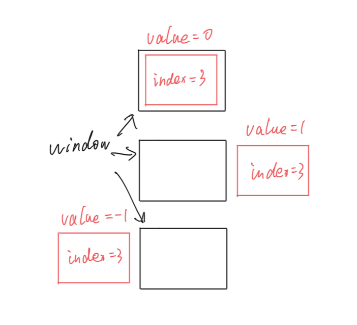

# 自定义动画

经过一些努力，我们终于在 v2 版本中实现了自定义动画，现在只需实现一个类型`TAnimationStyle`的回调函数，然后将它传给`Carousel`的`customAnimation`属性即可。

## 准备

```
type TAnimationStyle = (value: number) => Animated.AnimatedStyleProp<ViewStyle>;
```

这个函数会在每个 item 里去调用，并接受一个参数`value`表示当前 item 相对`window`所在的位置，下图展示了`value`和位置的关系



当拿到`value`后，我们只需要描述 item 在对应位置上如何展示，剩下的就交给`Animated`去执行吧。

### 小贴士

-   别忘了设置`zIndex`

---

## 发车！

下面写了几个例子

### 视差效果

<a href="../exampleExpo/src/advanced-parallax/index.tsx">
      
</a>

```ts
const animationStyle: TAnimationStyle = React.useCallback((value: number) => {
    'worklet';

    const zIndex = interpolate(value, [-1, 0, 1], [10, 20, 30]);
    const translateX = interpolate(
        value,
        [-1, 0, 1],
        [-PAGE_WIDTH * 0.5, 0, PAGE_WIDTH]
    );

    return {
        transform: [{ translateX }],
        zIndex,
    };
}, []);

<Carousel
    style={{ width: screen.width, height: 240 }}
    width={screen.width}
    data={[...new Array(6).keys()]}
    customAnimation={animationStyle}
    renderItem={({ index, animationValue }) => {
        return (
            <CustomItem
                key={index}
                index={index}
                animationValue={animationValue}
            />
        );
    }}
/>;

const CustomItem = ({ index, animationValue }) => {
    const maskStyle = useAnimatedStyle(() => {
        const backgroundColor = interpolateColor(
            animationValue.value,
            [-1, 0, 1],
            ['#000000dd', 'transparent', '#000000dd']
        );

        return {
            backgroundColor,
        };
    }, [animationValue]);

    return (
        <View style={{ flex: 1 }}>
            <SBItem key={index} index={index} style={{ borderRadius: 0 }} />
            <Animated.View
                pointerEvents="none"
                style={[
                    {
                        position: 'absolute',
                        top: 0,
                        left: 0,
                        right: 0,
                        bottom: 0,
                    },
                    maskStyle,
                ]}
            />
        </View>
    );
};
```

为了让`Carousel`外部实现一些动画效果，比如`MaskView`，我们将每个 Item 内部计算出来的动画值通过`renderItem`传递到了外部。

### 缩放渐入渐出效果

<a href="../exampleExpo/src/pages/scale-fade-in-out/index.tsx">
      
</a>

```ts
const animationStyle: TAnimationStyle = React.useCallback((value: number) => {
    'worklet';

    const zIndex = interpolate(value, [-1, 0, 1], [10, 20, 30]);
    const scale = interpolate(value, [-1, 0, 1], [1.25, 1, 0.25]);
    const opacity = interpolate(value, [-0.75, 0, 1], [0, 1, 0]);

    return {
        transform: [{ scale }],
        zIndex,
        opacity,
    };
}, []);

<Carousel
    style={{
        width: screen.width,
        height: 240,
        justifyContent: 'center',
        alignItems: 'center',
    }}
    width={screen.width * 0.7}
    height={240 * 0.7}
    data={[...new Array(6).keys()]}
    customAnimation={animationStyle}
    renderItem={({ index }) => {
        return <SBItem key={index} index={index} />;
    }}
/>;
```
