{/* 

=========================================================================
=========================================================================
This page generated by /scripts/gen-pages.mjs, Don't update it manually 
=========================================================================
=========================================================================

*/}

import { Cards } from 'nextra/components'
import Link from 'next/link'
import posthog from "posthog-js";

### Basic Layouts

<Cards num={2}>
  
        <Link href="/Examples/basic-layouts/stack" onClick={() => posthog.capture('example-clicked', { name: 'stack', kind: 'basic-layouts' })}>
          

            
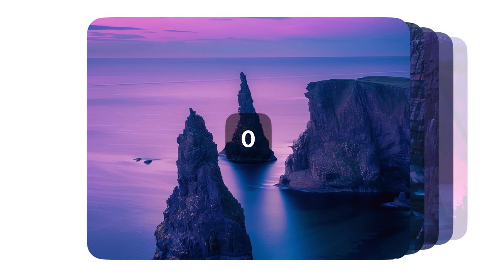

            

              Stack
            

          

        </Link>
  

        <Link href="/Examples/basic-layouts/parallax" onClick={() => posthog.capture('example-clicked', { name: 'parallax', kind: 'basic-layouts' })}>
          

            
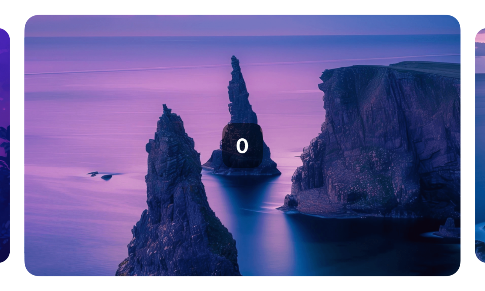

            

              Parallax
            

          

        </Link>
  

        <Link href="/Examples/basic-layouts/normal" onClick={() => posthog.capture('example-clicked', { name: 'normal', kind: 'basic-layouts' })}>
          

            
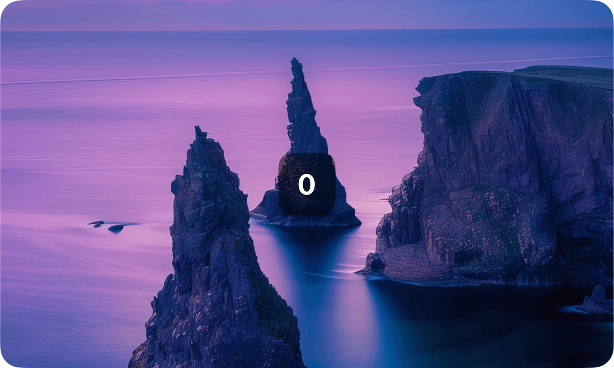

            

              Normal
            

          

        </Link>
  

        <Link href="/Examples/basic-layouts/left-align" onClick={() => posthog.capture('example-clicked', { name: 'left-align', kind: 'basic-layouts' })}>
          

            

            

              Left Align
            

          

        </Link>
  
</Cards>
  
### Utils

<Cards num={2}>
  
        <Link href="/Examples/utils/pagination" onClick={() => posthog.capture('example-clicked', { name: 'pagination', kind: 'utils' })}>
          

            

            

              Pagination
            

          

        </Link>
  
</Cards>
  
### Custom Animations

<Cards num={2}>
  
        <Link href="/Examples/custom-animations/tinder" onClick={() => posthog.capture('example-clicked', { name: 'tinder', kind: 'custom-animations' })}>
          

            
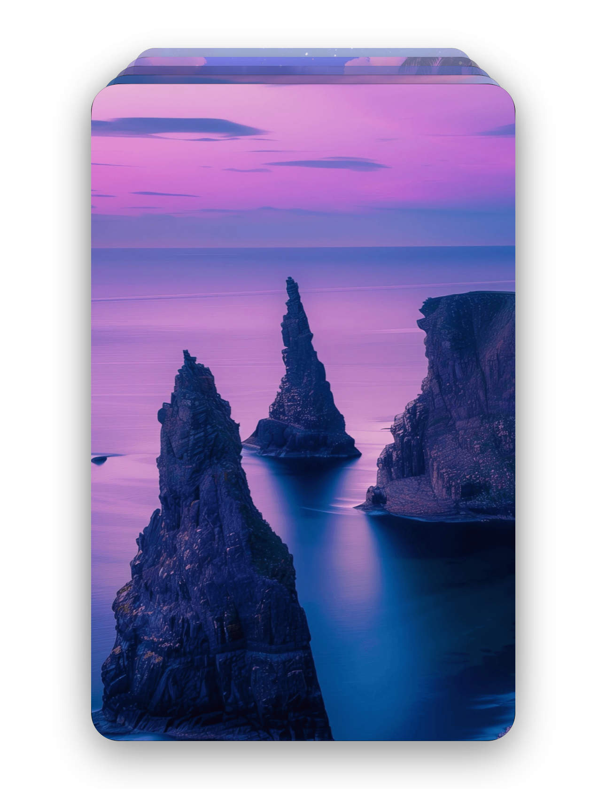

            

              Tinder
            

          

        </Link>
  

        <Link href="/Examples/custom-animations/scale-fade-in-out" onClick={() => posthog.capture('example-clicked', { name: 'scale-fade-in-out', kind: 'custom-animations' })}>
          

            
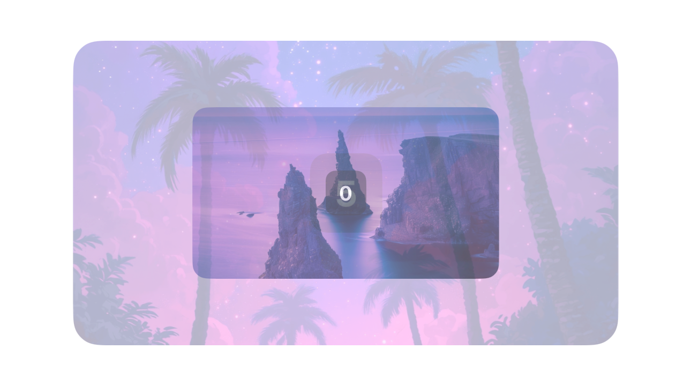

            

              Scale Fade In Out
            

          

        </Link>
  

        <Link href="/Examples/custom-animations/rotate-in-out" onClick={() => posthog.capture('example-clicked', { name: 'rotate-in-out', kind: 'custom-animations' })}>
          

            

            

              Rotate In Out
            

          

        </Link>
  

        <Link href="/Examples/custom-animations/rotate-fade-in-out" onClick={() => posthog.capture('example-clicked', { name: 'rotate-fade-in-out', kind: 'custom-animations' })}>
          

            
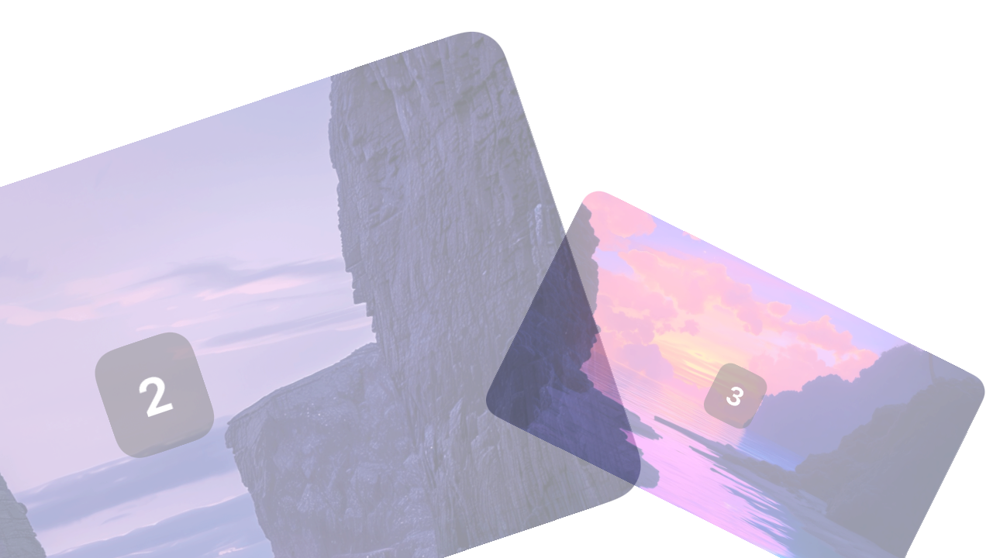

            

              Rotate Fade In Out
            

          

        </Link>
  

        <Link href="/Examples/custom-animations/quick-swipe" onClick={() => posthog.capture('example-clicked', { name: 'quick-swipe', kind: 'custom-animations' })}>
          

            
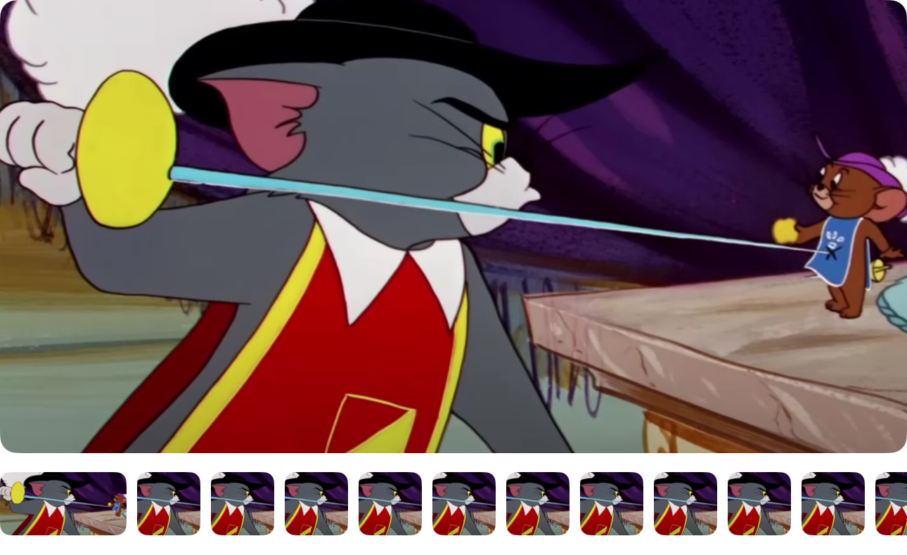

            

              Quick Swipe
            

          

        </Link>
  

        <Link href="/Examples/custom-animations/press-swipe" onClick={() => posthog.capture('example-clicked', { name: 'press-swipe', kind: 'custom-animations' })}>
          

            

            

              Press Swipe
            

          

        </Link>
  

        <Link href="/Examples/custom-animations/multiple" onClick={() => posthog.capture('example-clicked', { name: 'multiple', kind: 'custom-animations' })}>
          

            
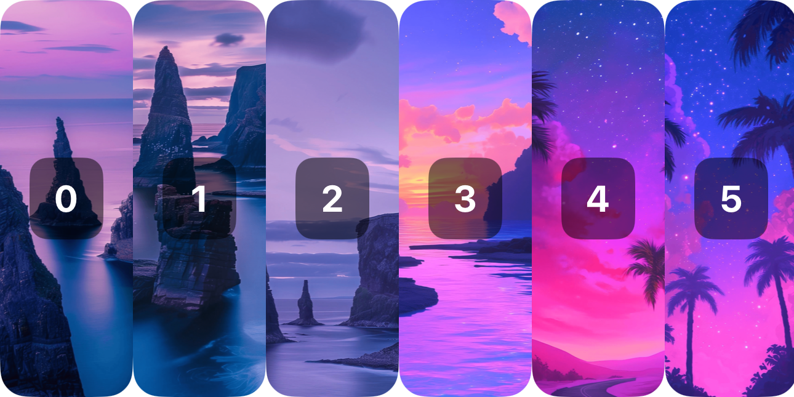

            

              Multiple
            

          

        </Link>
  

        <Link href="/Examples/custom-animations/fold" onClick={() => posthog.capture('example-clicked', { name: 'fold', kind: 'custom-animations' })}>
          

            
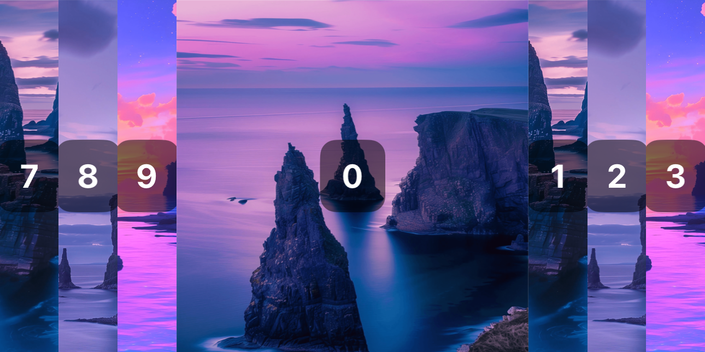

            

              Fold
            

          

        </Link>
  

        <Link href="/Examples/custom-animations/flow" onClick={() => posthog.capture('example-clicked', { name: 'flow', kind: 'custom-animations' })}>
          

            
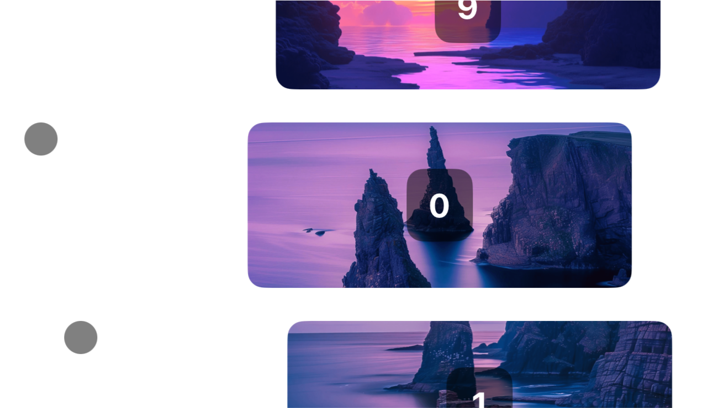

            

              Flow
            

          

        </Link>
  

        <Link href="/Examples/custom-animations/curve" onClick={() => posthog.capture('example-clicked', { name: 'curve', kind: 'custom-animations' })}>
          

            
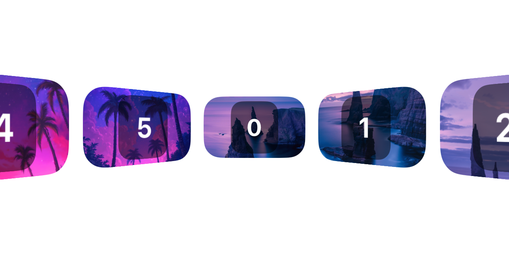

            

              Curve
            

          

        </Link>
  

        <Link href="/Examples/custom-animations/cube-3d" onClick={() => posthog.capture('example-clicked', { name: 'cube-3d', kind: 'custom-animations' })}>
          

            
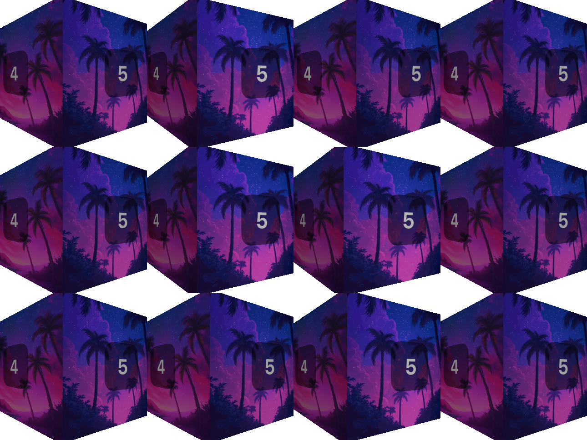

            

              Cube 3d
            

          

        </Link>
  

        <Link href="/Examples/custom-animations/circular" onClick={() => posthog.capture('example-clicked', { name: 'circular', kind: 'custom-animations' })}>
          

            
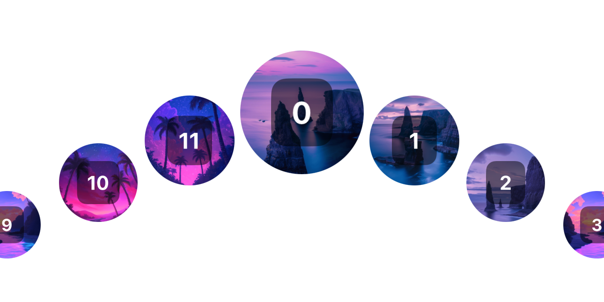

            

              Circular
            

          

        </Link>
  

        <Link href="/Examples/custom-animations/blur-rotate" onClick={() => posthog.capture('example-clicked', { name: 'blur-rotate', kind: 'custom-animations' })}>
          

            
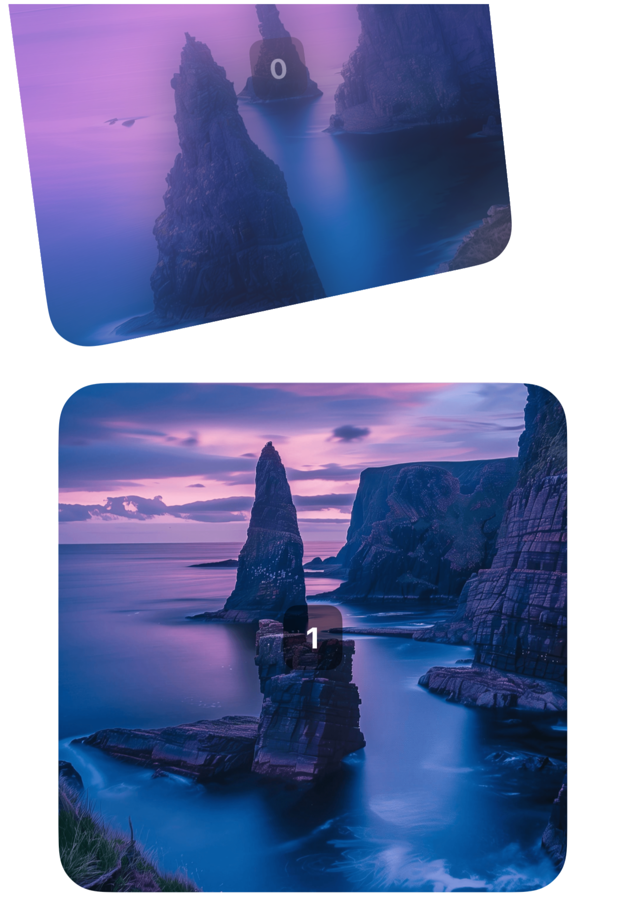

            

              Blur Rotate
            

          

        </Link>
  

        <Link href="/Examples/custom-animations/blur-parallax" onClick={() => posthog.capture('example-clicked', { name: 'blur-parallax', kind: 'custom-animations' })}>
          

            
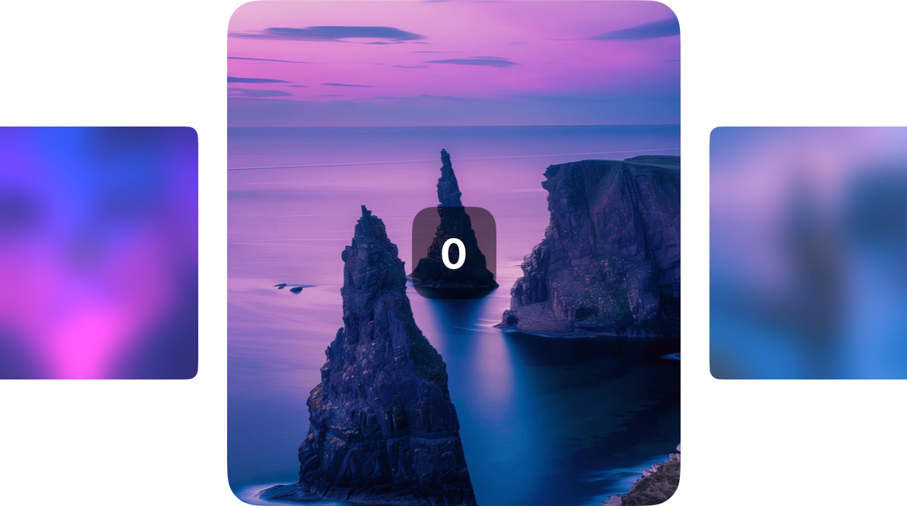

            

              Blur Parallax
            

          

        </Link>
  

        <Link href="/Examples/custom-animations/anim-tab-bar" onClick={() => posthog.capture('example-clicked', { name: 'anim-tab-bar', kind: 'custom-animations' })}>
          

            
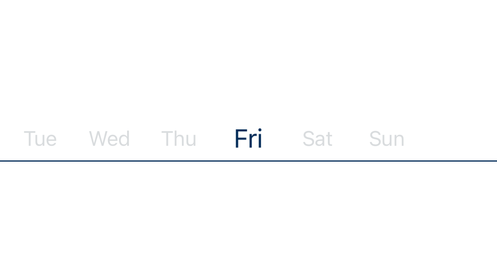

            

              Anim Tab Bar
            

          

        </Link>
  

        <Link href="/Examples/custom-animations/advanced-parallax" onClick={() => posthog.capture('example-clicked', { name: 'advanced-parallax', kind: 'custom-animations' })}>
          

            
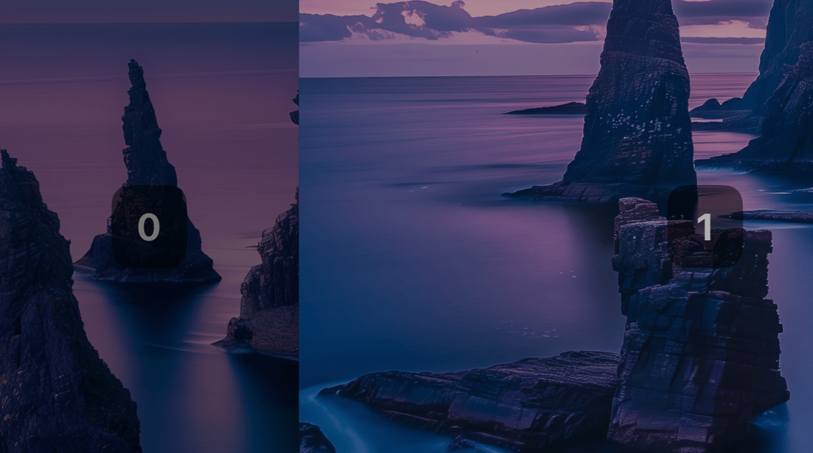

            

              Advanced Parallax
            

          

        </Link>
  
</Cards>