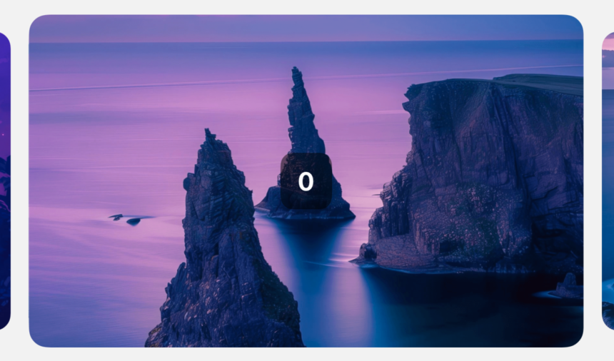

{/* 

=========================================================================
=========================================================================
This page generated by /scripts/gen-pages.mjs, Don't update it manually 
=========================================================================
=========================================================================

*/}

import { Cards } from 'nextra/components'
import Link from 'next/link'

<Cards num={2}>
  
        <Link href="/Examples/left-align">
          

            

            

              left-align 
            

          

        </Link>
  

        <Link href="/Examples/normal">
          

            

            

              normal 
            

          

        </Link>
  

        <Link href="/Examples/pagination">
          

            

            

              pagination 
            

          

        </Link>
  

        <Link href="/Examples/parallax">
          

            

            

              parallax 
            

          

        </Link>
  

        <Link href="/Examples/stack">
          

            

            

              stack 
            

          

        </Link>
  
</Cards>