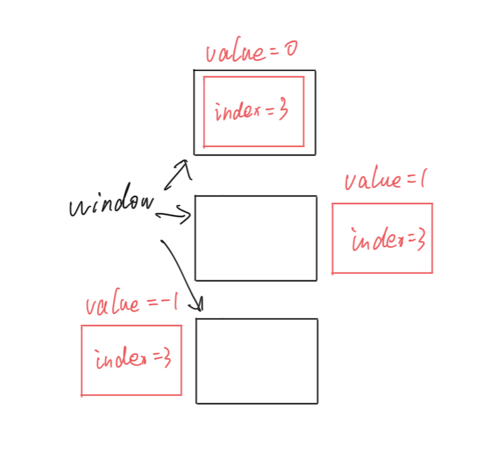
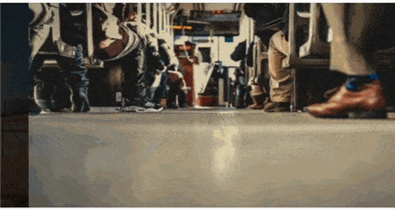

# Custom Animation
---

import { Callout } from 'nextra/components'


Pass a worklet-compatible callback of type `TAnimationStyle` to the `customAnimation` prop.

### Prepare

```ts
import type { TAnimationStyle } from "react-native-reanimated-carousel";

const animationStyle: TAnimationStyle = (value, _index) => {
  "worklet";

  return {
    opacity: Math.max(0, 1 - Math.abs(value)),
    zIndex: Math.round(100 - Math.abs(value)),
  };
};
```

The callback receives `value`, the item's animated position relative to the viewport, and `index`, the item's data index. The following picture shows the relationship between `value` and position.



After getting the `value`, we only need to describe how the item is displayed in the corresponding position, and the rest is handed over to `Animated` to execute.

<Callout type="info" emoji="ℹ️">
Don't forget to set `zIndex`
</Callout>

### Let's get started!

Here are a few examples.

#### Parallax

<a href="https://github.com/dohooo/react-native-reanimated-carousel/blob/main/example/app/app/demos/custom-animations/advanced-parallax/demo.tsx">
    
</a>

```ts
const animationStyle: TAnimationStyle = React.useCallback((value: number) => {
    'worklet';

    const zIndex = interpolate(value, [-1, 0, 1], [10, 20, 30]);
    const translateX = interpolate(
        value,
        [-1, 0, 1],
        [-PAGE_WIDTH * 0.5, 0, PAGE_WIDTH]
    );

    return {
        transform: [{ translateX }],
        zIndex,
    };
}, []);

<Carousel
    style={{ width: screen.width, height: 240 }}
    data={[...new Array(6).keys()]}
    customAnimation={animationStyle}
    renderItem={({ index, animationValue }) => {
        return (
            <CustomItem
                key={index}
                index={index}
                animationValue={animationValue}
            />
        );
    }}
/>;

const CustomItem = ({ index, animationValue }) => {
    const maskStyle = useAnimatedStyle(() => {
        const backgroundColor = interpolateColor(
            animationValue.value,
            [-1, 0, 1],
            ['#000000dd', 'transparent', '#000000dd']
        );

        return {
            backgroundColor,
        };
    }, [animationValue]);

    return (
        <View style={{ flex: 1 }}>
            <SBItem key={index} index={index} style={{ borderRadius: 0 }} />
            <Animated.View
                pointerEvents="none"
                style={[
                    {
                        position: 'absolute',
                        top: 0,
                        left: 0,
                        right: 0,
                        bottom: 0,
                    },
                    maskStyle,
                ]}
            />
        </View>
    );
};
```

In order to implement some animation effects outside `Carousel`, such as `MaskView`, we pass the animation value calculated inside each Item to the outside through `renderItem`.

#### ScaleFadeInOut

<a href="https://github.com/dohooo/react-native-reanimated-carousel/blob/main/example/app/app/demos/custom-animations/scale-fade-in-out/demo.tsx">
    
</a>

```ts
const animationStyle: TAnimationStyle = React.useCallback((value: number) => {
    'worklet';

    const zIndex = interpolate(value, [-1, 0, 1], [10, 20, 30]);
    const scale = interpolate(value, [-1, 0, 1], [1.25, 1, 0.25]);
    const opacity = interpolate(value, [-0.75, 0, 1], [0, 1, 0]);

    return {
        transform: [{ scale }],
        zIndex,
        opacity,
    };
}, []);

<Carousel
    style={{
        width: screen.width * 0.7,
        height: 240 * 0.7,
        justifyContent: 'center',
        alignItems: 'center',
    }}
    data={[...new Array(6).keys()]}
    customAnimation={animationStyle}
    renderItem={({ index }) => {
        return <SBItem key={index} index={index} />;
    }}
/>;
```
