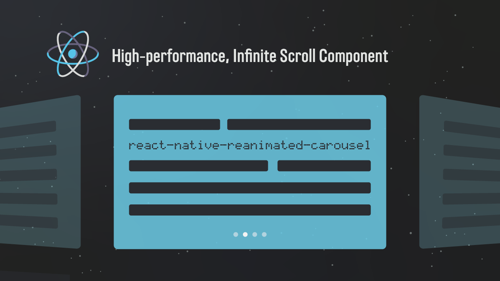

# React Native Reanimated Carousel
---

import { Badges } from '@/components/Badges'
import { Callout } from 'nextra/components'


<Callout emoji="🚀">
  v5 is currently in public beta. Install `react-native-reanimated-carousel@beta` with Reanimated 4.1 or newer and React Native Worklets. Upgrading from v4? Read the [v5 migration guide](/migration-v5).
</Callout>

<br/>
 
<div style={{borderRadius:"8px",overflow:"hidden"}}>

</div>
<Badges />

A performant carousel for React Native powered by Reanimated. ⚡️

## Features

- The best performance you can get. 🚀
- Fully configurable. ⚙️
- Support for both `iOS` & `Android` & `Web`. 📱
- Support for `RTL` layout. 🌍
- Smooth gesture interactions & snapping animations. 🏎
- Support to customise the animation style. 🎨
- Powered by Reanimated 4 and React Native Worklets. 🎉
- Compatible with `Expo`. 🎩
- Accessibility support. ♿️
- Written in `TypeScript`. 🌳

## Installation

Using Expo? Let Expo select compatible Reanimated and Worklets versions:

```bash
npx expo install react-native-reanimated-carousel@beta react-native-reanimated react-native-worklets react-native-gesture-handler
```

Using React Native Community CLI?

```bash
yarn add react-native-reanimated-carousel@beta react-native-reanimated react-native-worklets react-native-gesture-handler
```

<Callout type="warning" emoji="⚠️">
**React Native Gesture Handler** needs extra steps to finalize its installation, please follow their [installation instructions](https://docs.swmansion.com/react-native-gesture-handler/docs/fundamentals/installation). Please **make sure** to wrap your App with `GestureHandlerRootView` when you've upgraded to React Native Gesture Handler ^2.

**React Native Reanimated 4** requires a compatible `react-native-worklets` version. Follow the [Reanimated installation guide](https://docs.swmansion.com/react-native-reanimated/docs/fundamentals/getting-started) and [compatibility table](https://docs.swmansion.com/react-native-reanimated/docs/guides/compatibility). Community CLI projects must use the `react-native-worklets/plugin` Babel plugin as documented there.
</Callout>

## Your first carousel

Once the native dependencies are configured, this is a complete minimal example:

```tsx
import * as React from "react";
import { Text, useWindowDimensions, View } from "react-native";
import { GestureHandlerRootView } from "react-native-gesture-handler";
import Carousel from "react-native-reanimated-carousel";

const data = ["First", "Second", "Third"];

export default function App() {
  const { width } = useWindowDimensions();

  return (
    <GestureHandlerRootView style={{ flex: 1 }}>
      <View style={{ flex: 1, justifyContent: "center" }}>
        <Carousel
          style={{ width, height: 200 }}
          data={data}
          renderItem={({ item }) => (
            <View style={{ flex: 1, alignItems: "center", justifyContent: "center" }}>
              <Text>{item}</Text>
            </View>
          )}
        />
      </View>
    </GestureHandlerRootView>
  );
}
```

Continue with [Usage](/usage) for sizing and pagination, or open the full [Props reference](/props).


## Special thanks

<video src="quick-swipe.mp4" autoPlay loop muted className="w rounded-xl mt-2"/>
<div className="flex flex-row items-center justify-center p-4 rounded-lg mb-4 mt-4 ss-content ">
  
  <div>
    <p className="font-bold mb-2 text-2xl">Screen Studio</p>
    <p className="text-sm">Thanks to <a className="font-bold underline text-[#792fdc]" href="https://www.screen.studio/@nGeEY">Screen Studio</a> for sponsoring this library. You can use Screen Studio to record your screen and edit videos and get beautiful screen recordings in minutes.</p>
  </div>
</div>


## Sponsor & Support
To keep this library maintained and up-to-date please consider sponsoring to us. ☕️

- [Caspian](https://github.com/sponsors/dohooo) 
- GX
- [Oliver Lopez](https://github.com/sponsors/oliverloops) 

<p align="center">
  
</p>

## More high quality libraries made by me 🚀

- [react-native-reanimated-table](https://github.com/dohooo/react-native-reanimated-table)

## Built With ❤️

- [react-native-reanimated](https://github.com/software-mansion/react-native-reanimated)
- [react-native-gesture-handler](https://github.com/software-mansion/react-native-gesture-handler)
- [react-native-redash](https://github.com/wcandillon/react-native-redash)
- [react-native-builder-bob](https://github.com/callstack/react-native-builder-bob)
